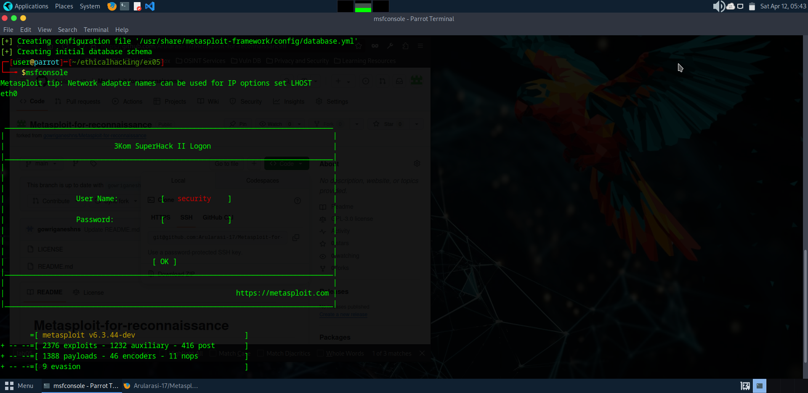
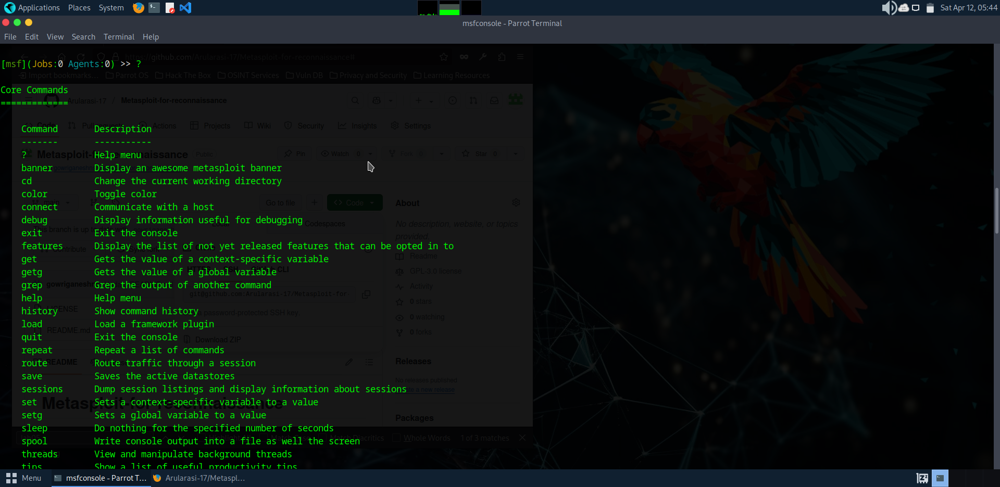
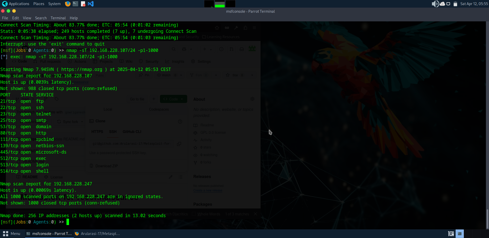
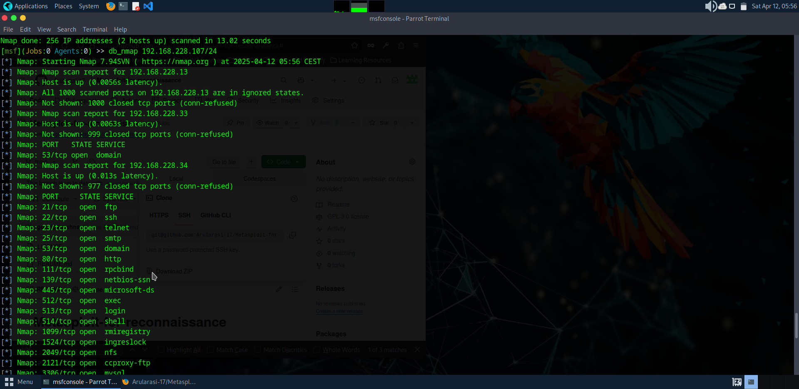
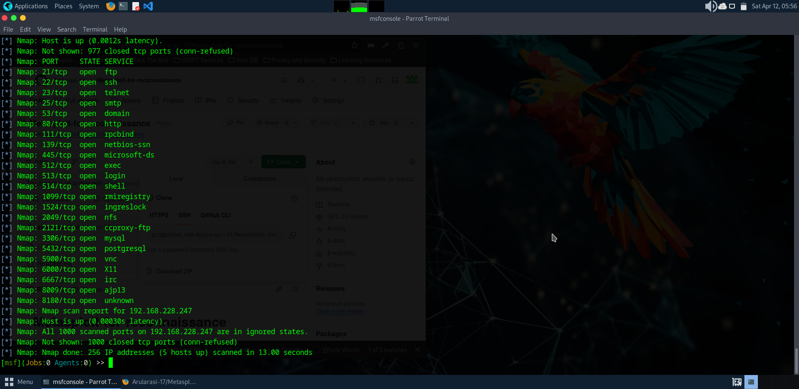
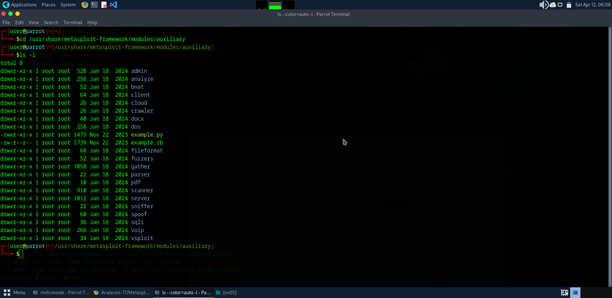
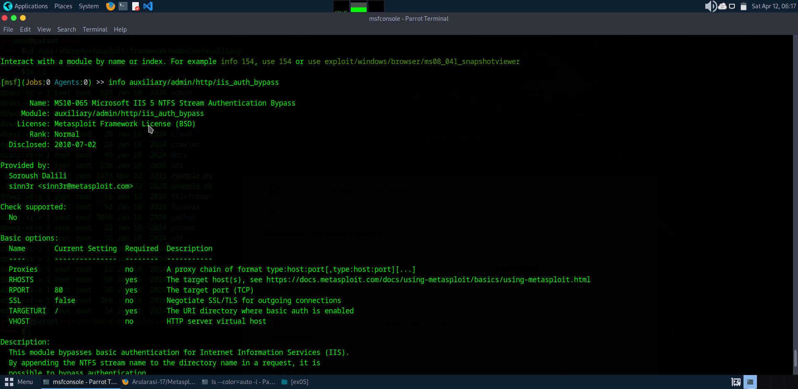
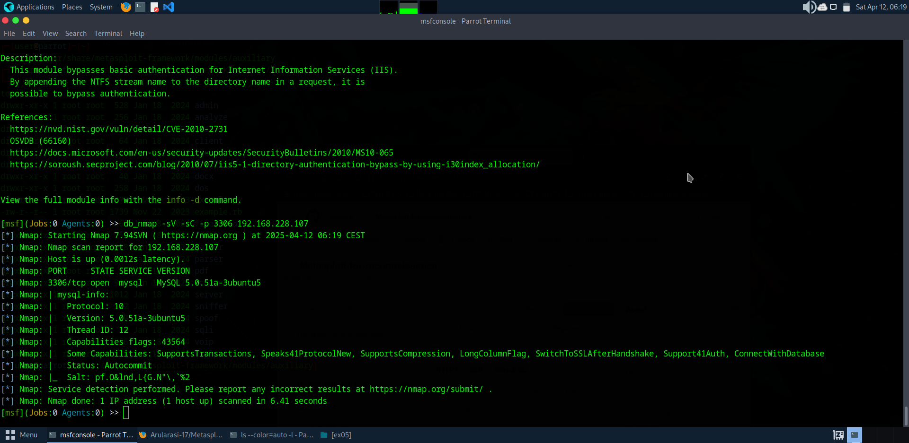
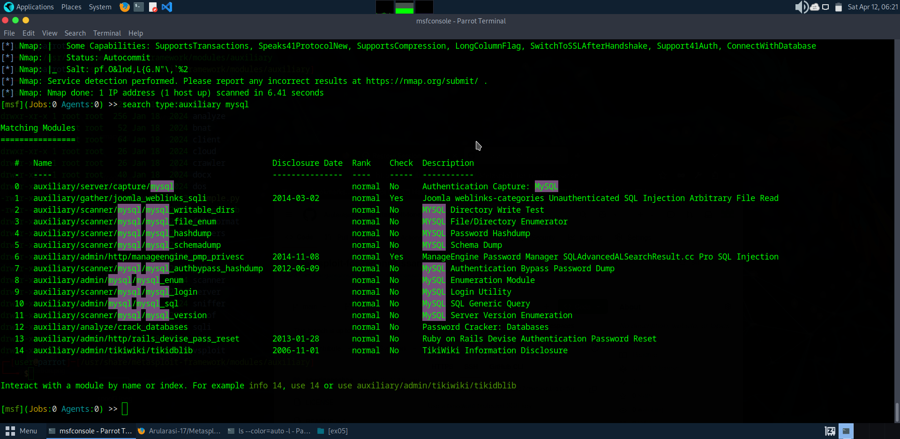
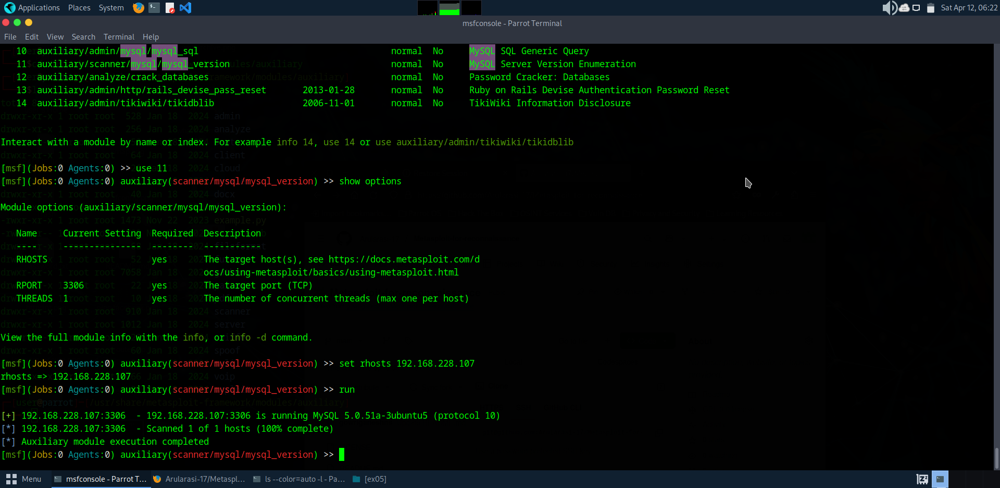

# Metasploit-for-reconnaissance
# Metasploit
Metasploit for reconnaissance in pentesting

# AIM:

To get introduced to Metasploit Framework and to  perform reconnaissance  in pentesting .

## DESIGN STEPS:

### Step 1:

Install kali linux either in partition or virtual box or in live mode

### Step 2:

Investigate on the various categories of tools as follows:

### Step 3:

Open terminal and try execute some kali linux commands

## EXECUTION STEPS AND ITS OUTPUT:

## OUTPUT:

Find out the ip address of the attackers system

Invoke msfconsole

.png)

Type help or a question mark "?" to see the list of all available commands you can use inside msfconsole.

!

Following command is executed for scanning the systems on our local area network with a TCP scan (-sT) looking for open ports between 1 and 1000 (-p1-1000). msf > nmap -sT 192.168.228.247/24 -p1-1000

use the db-nmap command to scan and save the results into Metasploit's postgresql attached database. In that way, you can use those results in the exploitation stage later.

scan the targets with the command db_nmap as follows. msf > db_nmap 192.168.228.247/24

Metasploit has a multitude of scanning modules built in. If we open another terminal, we can navigate to Metasploit's auxiliary modules and list all the scanner modules. cd /usr/share /metasploit-framework/modules/auxiliary kali > ls -l

Search is a powerful command in Metasploit that you can use to find what you want to locate. msf >search name:Microsoft type:exploit

The info command provides information regarding a module or platform

##MYSQL ENUMERATION Find the IP address of the Metasploitable machine first. Then, use the db_nmap command in msfconsole with Nmap flags to scan the MySQL database at 3306 port. db_nmap -sV -sC -p 3306 <metasploitable_ip_address>

## RESULT:
The Metasploit framework for reconnaissance is  examined successfully
